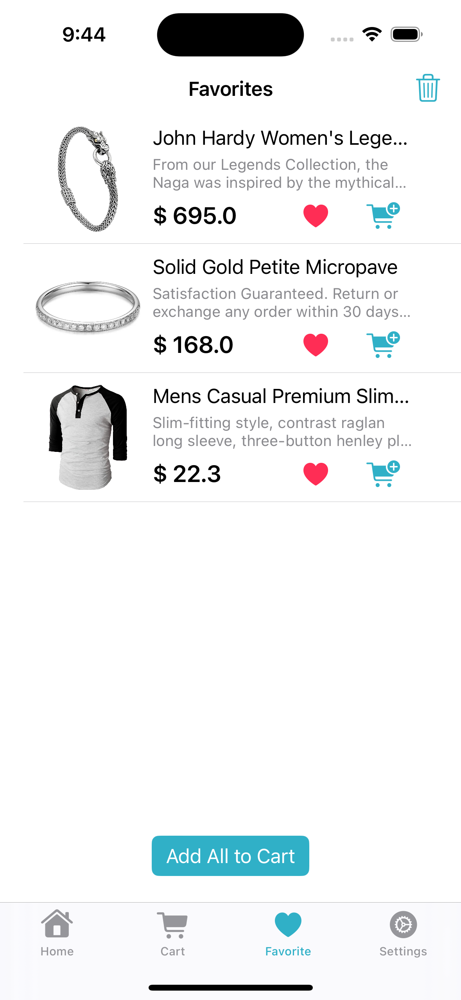

# Qshopping V1.0.0

QShopping is a mobile shopping application developed using Swift. It allows users to browse and shop for products using the fakestore API.

## Screenshots

## Features

- Users are directed to a registration or login screen upon launching the app.
- Option to log in using tester accounts.
- Displays product listings fetched from the fakestore API.
- Users can filter products by category (electronics, jewelry, men's clothing, women's clothing).
- Search bar for searching specific products.
- Filter products by price and rating.
- Sort products by price (ascending or descending), most reviewed, and highest-rated.
- Add items to the cart and favorite products.
- View product details and remove them from favorites.
- View and manage cart items.
- Settings section for displaying user information and logging out.

## Requirements

- Xcode 14 or higher
- Swift 5.0 or higher

## Installation

1. Clone or download the QShopping project to your local machine.
2. Open the project in Xcode.
3. Build and run the project on a simulator or device.

## Usage

1. Launch the application.
2. Log in with a tester account or manually enter a username and password.
3. Explore the product listings, use the search bar, and apply filters and sorting options.
4. View product details, add items to the cart, and manage favorites.
5. Access the cart to modify items and quantities.
6. Switch to the "Favorites" tab to view and manage favorited products.
7. Use the "Settings" section to view user information and log out.

### Tester Usernames and Passwords

| Username  | Password     |
| --------- | ------------ |
| johnd     | m38rmF$      |
| mor_2314  | 83r5^_       |
| kevinryan | kev02937@    |
| donero    | ewedon       |
| derek     | jklg*_56     |
| david_r   | 3478*#54     |
| snyder    | f238&@*$     |
| hopkins   | William56$hj |
| kate_h    | kfejk@*_     |
| jimmie_k  | klein*#%*    |

## Licence

[MIT](https://choosealicense.com/licenses/mit/)
